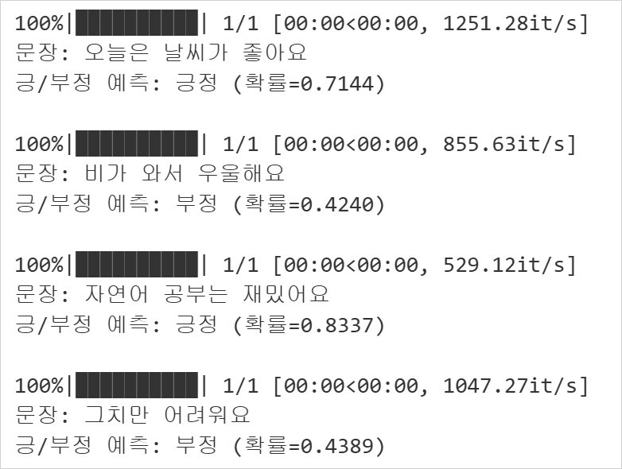

# 네이버 영화 리뷰 감성 분석 📽️

### 1. 사용한 데이터 셋 📁

제가 사용한 데이터 셋은 **네이버 영화 리뷰 데이터 셋**입니다. 

|항목|설명|
|---|---|
|출처|[Naver Sentiment Movie Corpus (NSMC)](https://raw.githubusercontent.com/e9t/nsmc/master/ratings_train.txt)|
|크기|약 78MB|
|학습용 데이터|150,000개|
|평가용 데이터|50,000개|
|주요 컬럼|`id`, `document`, `label`|

 

### 2. 실행 결과 ➰

사용자에게 문장을 입력 받아 해당 문장이 **긍정**인지 **부정**인지 예측

